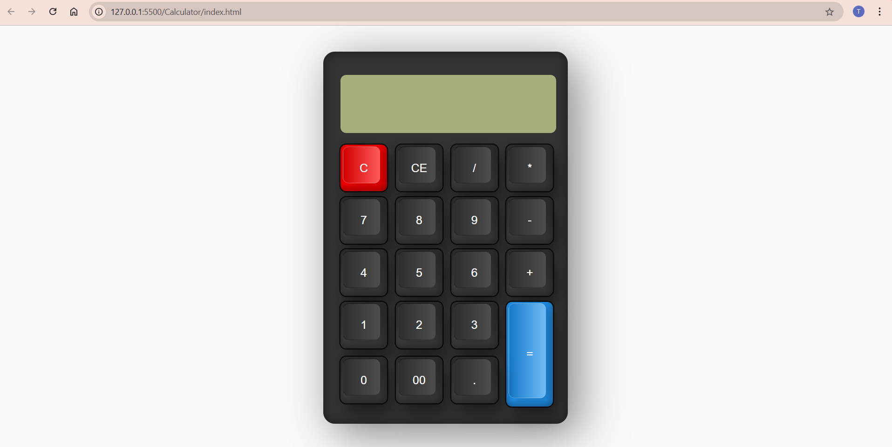

# 🧮 Simple Calculator Web App

This is a simple and responsive calculator built using **HTML**, **CSS**, and **JavaScript**. It performs basic arithmetic operations such as addition, subtraction, multiplication, and division.

## 📸 Demo

 <!-- Replace with actual screenshot or remove -->

Try it live 👉 [GitHub Pages Link](https://github.com/prachi-raut-04/Calculator) <!-- Replace with actual link -->

---

## 🚀 Features

- Responsive design
- Basic arithmetic operations:
  - Addition
  - Subtraction
  - Multiplication
  - Division
- Clear & delete functionality

---

## 🛠️ Technologies Used

- **HTML5** – Markup structure
- **CSS3** – Styling and layout
- **JavaScript** – Calculator logic and interactivity
